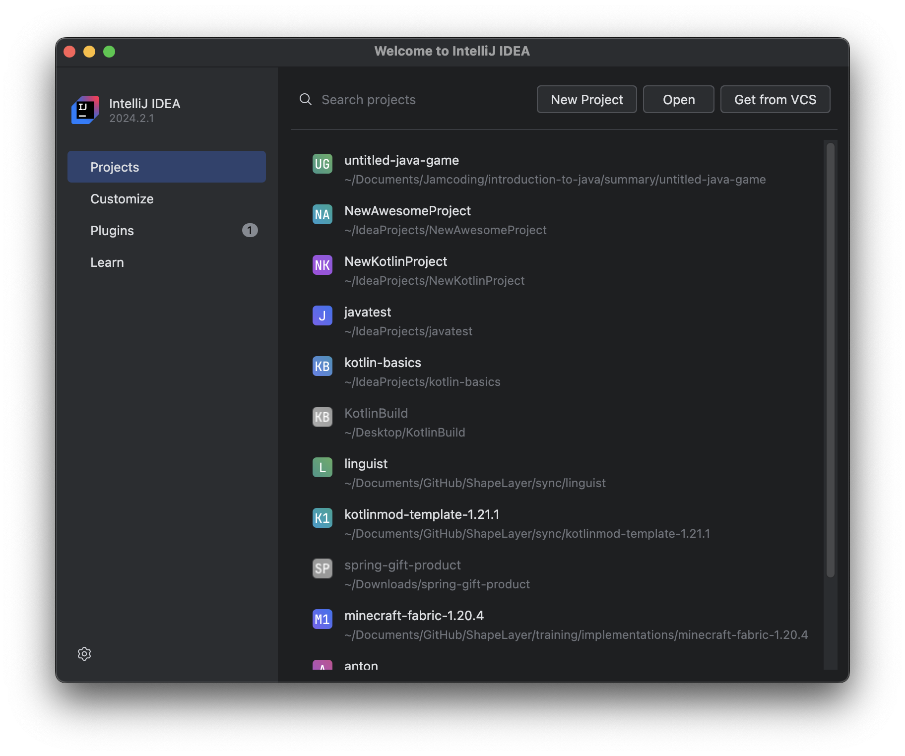
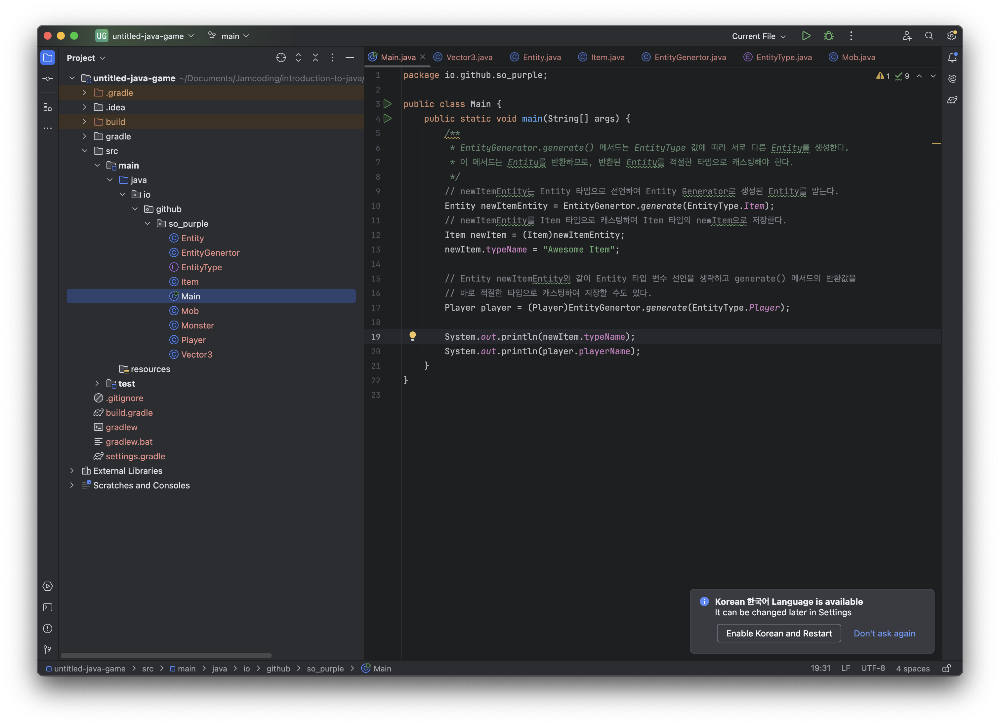
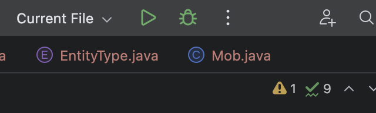

# Summary

_마지막 회차 수업 중 문제 해결 예제_

이 프로젝트는 IntelliJ IDEA로 작성되어, IntelliJ IDEA가 기본값으로 생성한 프로젝트 구조를 따릅니다.  

소스코드는 [`./src/main/java/io/github/so_purple/` 경로 아래에서 확인할 수 있습니다. (클릭하여 바로가기)](./src/main/java/io/github/so_purple/)

모든 클래스는 각자의 파일로 분리되어 있으며, 파일명이 클래스명으로 설정되어 있습니다.

## 실행하기

이 프로젝트를 실행하는 데 다양한 방법이 있지만, IntlliJ IDEA를 사용하는 것이 가장 쉽습니다.  

### IntelliJ IDEA로 프로젝트 열기

IntelliJ IDEA를 실행하고 `Open`을 클릭하여 이 경로 아래의 `untitled-java-game` 폴더를 선택합니다.  

이어서 열리는 프로젝트에서 좌측의 프로젝트 탐색기 패널에서, 폴더를 순차적으로 클릭하여 `src/main/java/io/github/so_purple/Main` 경로의 소스코드를 화면에 나타나도록 엽니다.  

`Main.java` 파일을 열었다면, 화면 우측 상단의 `Run` 버튼을 클릭하여 프로그램을 실행합니다.
